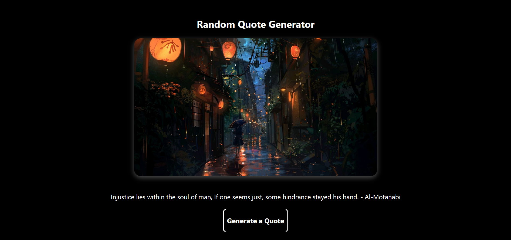

# 🎯 Random Quote Generator

A minimalist and elegant quote generator built with **React** and **Vite**.  
Each time you click the button, it shows a new random quote paired with a visually pleasing background image.

 

---

## 🚀 Features

- ✅ Random inspirational quotes from various sources
- ✅ Dynamic background images
- ✅ Smooth fade-in animation on each quote
- ✅ Clean, responsive layout
- ✅ Deployed with GitHub Pages

---

## 🛠 Tech Stack

- **React** (Functional Components & Hooks)
- **Vite** (Lightning-fast build tool)
- **CSS** for custom styling and animations
- **GitHub Pages** for deployment

---

## 📸 Live Demo

👉 [Click here to try it live](https://harrakyass.github.io/quote_generator/)  
*(hosted via GitHub Pages)*

---

## 🧠 Inspiration Behind It

This project was built as a personal React practice challenge to:
- Master state updates with `useState`
- Learn conditional rendering
- Practice image and asset imports
- Apply clean styling with CSS transitions
- Simulate a small UI-centered tool with real-world UX patterns

---

## 🗂 Project Structure
    quote_generator/
├── public/
├── src/
│ ├── assets/
│ │ └── images.jsx
│ ├── components/
│ │ └── QuoteGenerator.jsx
│ ├── App.jsx
│ └── main.jsx
├── index.css
├── vite.config.js
└── README.md


---

## 🧩 How to Run Locally

1. Clone the repository:

    ```bash
    git clone https://github.com/Harrakyass/quote_generator.git
    cd quote_generator

2. Install dependencies:
    npm install
3. Start the development server:
    npm run dev
4. Open http://localhost:5173 in your browser.


